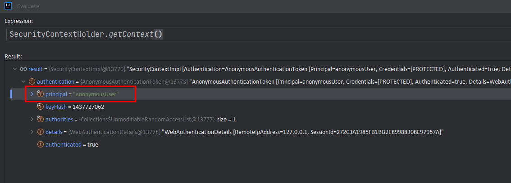

# 프로젝트로 배우는 스프링
reference : [커리큘럼 스프링과 JPA 기반 웹 애플리케이션 개발, 백기선](https://www.inflearn.com/course/%EC%8A%A4%ED%94%84%EB%A7%81-JPA-%EC%9B%B9%EC%95%B1/dashboard)
* 하게 된 이유 : 현업에서 막막하게 개발해야하는 상황을 미리 체험하고 극복하기 위해 어떤 노력이 더 필요한지 가감없이 느껴보기 위함
* 프로젝트 시작일 : 10/16, 9:40PM 
* 프로젝트 종료일 : tbd

## Feature1 : 회원가입
* Domain 개발
* Controller 개발

### 1. 도메인 개발
Account 도메인에 필요한 데이터는 **DB에 저장할 필요가 있는지 에 대한 고민**부터 시작해야 합니다.
* 로그인
  * 이메일/닉네임/패스워드/검증절차(이메일 검증/토큰)/가입날짜(검증 완료 후)
* 프로필
  * 소개글/직업/url/거주지/프로필사진
* 알림설정
  * notice path(web or email)

### 1-1. Work Flow  
각 기능에서 필요로 하는 필드값을 명확하게 정의해야 합니다. 1)로그인 과정에서 email-checked 한다던가 2)프로필을 통해 보여주고자 하는 데이터 등이 포함되겠습니다.

* 로그인할때 필요한 ID(unique)/PW
* 검증된 회원인지 체크/토큰
* 검증됐다면 가입날짜
* 프로필 생성
* 커뮤니티 관련 알림설정

### 2. 컨트롤러 개발
GET("/sign-up") 요청시 view 페이지를 보여주는 컨트롤러를 개발합니다. 개발 후 테스트까지 실행합니다.

### 2-1. Work Flow
페이지를 보여주는데서 끝나는게 아니라, 추가 설정과 테스트를 반드시 수행합니다.

* spring MVC
* security access 를 위한 config 설정
* 테스트

### 3. 회원가입 뷰
어느정도 작업한 히스토리가 있으면 그걸 복붙해서 추가 디벨롭해도 될 부분이라고 생각합니다.

### 3-1. Work Flow
* view 기본 페이지 설정
* css style 적용
* 테스트 (model.attribute)

### 4. Form submit 검증
데이터 유효성 검사는 굉장히 중요합니다. 데이터베이스에 쓰레기 값이 저장되면 안되기 때문에 항상 주의해야 합니다.

* JSR 303 Bean Validation (@Valid)
  * 값의 길이, 필수값 (필드검증)
* 커스텀 검증([Validator](https://docs.spring.io/spring-framework/reference/core/validation/validator.html))
  * 중복 이메일, 닉네임 여부 확인
* 폼 에러 있을 시, 폼 다시 보여주기

부족한점
* 메서드 이름 : signUp -> signUpSubmit
* @ModelAttribute : 복합 객체로 받으려고 할때 > 파라미터로 사용할때 생략할 수 있습니다
* @Pattern() : data binding validation시, 정규식으로 필터링
  * 정규표현식 : ^~~$ (시작과 끝을 적어두고 출발하면 편합니다)
  * @Pattern(regexp = "^[ㄱ-ㅎ가-힣a-z0-9_-]{3,20}$") // 자주 쓰이는 패턴이니 사용하시면서 익숙해지실 겁니다

잘한점
* 파라미터 validation 애노테이션 활용 잘했음

### 4-1. Work Flow
* 데이터 유효성 검사
  * `@Valid` : 클라이언트가 입력한 필드값에 대한 단순 검증 (형식적인 검증)
  * `Validator` : 비지니스 로직에 따른 복잡한 검증 (DB를 참조하여 조작이 불가능한 실제 데이터와 비교, 신뢰성이 높은 검증)
    * email / nickname duplicate check from DB (find보다는 exists로 구현하는게 목적에 부합하다고 생각함)
* Errors O -> form 화면
* Errors X -> DB 중복체크 -> DB 저장 (단방향 : service -> repository)
* 최종 반환 : 리다이렉트 루트 (redirect:/)

### 몰랐던 부분
* `@Repository`: 데이터 접근 계층에서 예외 변환 기능을 활성화하고, 데이터베이스 관련 로직을 포함하는 클래스를 Spring Bean으로 등록.
* `@Controller` : 프레젠테이션 계층에서 HTTP 요청을 처리하고, 뷰와 데이터를 반환하는 컨트롤러 클래스로 Spring MVC와 연동.
* `@Service` : 비즈니스 로직을 처리하는 서비스 계층의 클래스를 명시하며, 이를 Spring Bean으로 등록하여 가독성을 높임.
* Repository에 @Transactional(readOnly = true)을 붙이는 이유
  * 성능 최적화 : 단순 조회의 경우, 변경 감지 로직 처리를 하지 않음
  * 명확한 의도 전달 : 해당 트랜잭션이 단순 조회임을 분명히 함
* `@Transactional` 알고 쓰자.
  * 정의 : 데이터베이스 작업을 하나의 단위로 묶어서 처리할 때, 하나의 트랜잭션 범위 내에서 수행될 수 있도록 합니다.
  * 레포지토리에 적용할때 : 단순 조회인 경우, 성능 최적화를 명확하게 전달
  * 서비스에 적용할 때 : 비지니스 로직을 수행하면서 데이터 수정/삭제/추가 등 JPA 매커니즘(변경감지로직)에 의해 수행
* `@InitBinder` : 바인딩 되는 객체에 대해서 선언될때마다 validator 작업을 자동으로 해줍니다.
* `@Component` : 스프링 애플리케이션 컨텍스트가 관리하는 빈으로 등록 및 동작할 수 있도록 해줍니다.

### 5. Form submit 처리

* 회원 정보 저장
* 인증 이메일 발송 
* 처리 후 첫 페이지로 리다이렉트 (Post-Redirect-Get)

### 5-1. Work Flow
* 회원 정보 저장
* 인증 이메일 발송
  * 임시 토큰 발급 - UUID
  * 이메일 발송 (JavaMailSender)

### 몰랐던 부분
* password encoding 필요 -> token. 평문 저장시 굉장히 위험한 서비스. 고객 정보 유출됨. 아주 큰일남.
* spring mail sender 가 어떻게 동작하는지 -> 이거 찾아서 공부할 것
  * 메세지 생성 : SimpleMailMessage 객체를 생성해서 수신자/제목/내용을 만들어줍니다
  * 메일 송부 : JavaMailSender.send()
* Profile 설정 : @Profile(name) 어노테이션 추가 후, yml 파일에 `profiles.active=local`
* Token 발급 : UUID를 이용한 임시 인증 토큰 생성
  * UUID(Universally Unique Identifier)로 36자(32자 + 4개의 하이픈) 길이를 가집니다.

### 알아두면 편리한점
* 기능 구현을 하고, 테스트하기 전에 해당 기능이 잘 동작하는지 항상 로그를 찍어볼 것

### 5-2. 테스트 코드 작성
로직을 차례대로 따라가면서 unit 테스트로 최대한 빈틈없게 작성할 것. 테스트 성공 뿐만 아니라 실패가 발생하는 상황(**로직 주석처리**)도 연출해보기.
* POST "/sign-up", 파라미터로 데이터 전송 (**html에서 어떤 데이터가 넘어오는가**)
  * spring security + thymeleaf > html hidden csrf token default 적용됨
  * 인증되지 않은 사용자 접근을 받아들이되, 안전하지 않은 요청까지 받아들이진 않는게 본질입니다. 폼 데이터를 전송하는 테스트 코드는 csrf 반드시 추가해야 합니다.
* 검증
  * 입력값 오류시 동작 -> 폼 화면이 다시 보여지는가
  * 입력값 정상시 동작
    * 회원 저장이 되는가
    * 이메일이 발송되는가
* `Mocking` : 외부 연동을 통한 테스트
  * 인터페이스만 사용하고, 실제로 메일을 발송하는 건 외부 서비스 입니다.
  * Gmail, 네이버 메일 등 메일박스를 열고 꺼내고 실제 데이터를 확인하는 건 유지보수성에 취약함

끝으로, 테스트 코드 비교(초기 vs 수정)하면서 미흡했던 점을 생각해봤습니다. 구멍이 많이 보이는, 의미없는 테스트였네요.

|| target               | action                      |
|-----|----------------------|-----------------------------|
|초기| 회원 저장                | repository에서 직접 데이터를 꺼내와서 비교 |
|초기| 이메일 발송               | 이메일이 발송됐는지 / 발송된 이메일을 꺼내서 비교 |
|수정| POST "url" 입력값 오류 처리 | 다시 폼 화면 보여주기                |
|수정| POST "url" 입력값 정상 처리 | 회원 정보 저장 / 이메일 발송됐는지        |

### 5-3. 리팩토링
* 맥락 (논리적으로 서술되어야 합니다.)
* 각 계층의 본질에 집중하여 너무 많은 책임을 전가하지 않아야 합니다. 
* 읽기 편해야 됩니다.
* 끝으로 리팩토링이 다른 코드에 영향을 주지 않았다는 것을 증명하기 위해 지금까지의 테스트 코드 실행/PASS 확인

### 6. 패스워드 인코딩
보안에 민감한 정보는 양방향(암호화/복호화)를 할 필요가 없습니다. PW는 오직 단방향. 해싱을 하면 된다.
* Configuration passwordEncoder(bcrypt)
* test
  * account 가 null 이 아닌지
  * 저장된 패스워드가 평문 패스워드가 아닌지
  * 입력한 평문이 변환된 해시값과 일치하는지만 체크

해싱 알고리즘을 쓰는 이유
* 대부분은 유저는 한가지 비밀번호를 여러 사이트에서 사용함 > 엄청 큰 문제임
* PW 자체가 털리는건.. 은행 계좌번호 or 주식 계좌번호 등..
* 해싱 : 문자열을 특정한 보안 알고리즘에 따라서 암호화한다. xf unkasdhfuaweikfhueawkrfhjeoaw 

솔트를 쓰는 이유
* 솔트 : 랜덤 바이트 ( pw+salt => 전혀 다른 값. salt 로 인해서 매번 해시값이 바뀜) 
  * 해커가 dictionary attack. 이미 해시값들을 변환해놓고, PW를 유추함
  * 그럼 어떻게 pw를 찾을 수 있는가?
  * 나온결과에 해시값 자체를 salt 처럼 써서, 다시 해싱ㅂ해버리면 기본 평문이 나옴 > 알고리즘 특성상 원래 해시값이 나옵니다.


Bcrypt 의 경우, 강도가 10 으로 설정함. 강도가 높아질수록 시간이 오래 걸림. 그만큼 해커들이 해킹하는데 힘들다는 얘기.
오히려 느린게 장점인거죠.

코드 접근방법이 완전히 틀림. 솔직히 몰랐고. 찾아봐도 몰랐음. 왜냐하면 AppConfig 로 설정해줘야했거든. 어떨때 AppConfig 로 구분해야하는지 몰랐다는거지


### 7. 인증 메일 확인
`인증` 절차가 필요한 이유 : 허위를 가려내 실제 서비스를 이용하는 고객들에게 알맞은 정보와 혜택을 제공하기 위함입니다.

* GET "check-mail-token?token={}&email={}" 요청 처리
  * 이메일이 정확하지 않은 경우에 대한 에러 처리
  * 토큰이 정확하지 않은 경우에 대한 에러 처리
  * 정확하게 입력됐을 경우 가입 완료 처리 
    * 가입 일시1
    * 이메일 인증 여부 true 설정

* view 
  * 입력값 오류 시 alert 보여주기
  * 입력값 정상(인증 완료) 처리 후 몇번째 사용자인지 보여주기

### 부족한점
문제점 : GET 동작 방식에 대한 이해도가 낮다. 즉, GET Mapping을 통해 view 렌더링하는게 목적이고 model 객체에 담아서 데이터를 전달하는 사고과정이 필요했습니다.
* @Valid 검증이 붙을 필요가 없습니다. 이유는 POST 에서 기 검증 완료
* error 보여줄땐 model에 담아서 error 객체 꺼내서 쓰면 됩니다. (html 기준, th:if=${error})
* 처음부터 너무 깊게 고민하면 코드를 잘 짤 수가 없습니다. 원하는 기능이 동작될 수 있도록 최대한 단순하게 설계하고, 테스트하고, 리팩토링(레이어 변경 등) 순으로 진행하면 좋을 것 같습니다.

### 8. 자동 로그인
목표
* 회원 가입 완료시 login
* 이메일 인증 완료시 login 

자동 로그인 처리
* [SecurityContextHolder](https://docs.spring.io/spring-security/reference/servlet/authentication/architecture.html)

### 부족한점
문제점 : 새로운 기능 추가시, 열정적인 구글링이 부족하고 어떻게 접근해야할지 레퍼런스 자료를 찾아보는게 익숙하지 않습니다. 어떤 게 키워드인지 빠르게 파악하고 디테일하게 찾아가는 과정이 필요해 보입니다ㅓ.
* 로그 찍는 습관은 여전히 부족합니다.
* 테스트 도중 발생한 에러 관련, **Authentication should not be null** 이슈를 해결해 가는 과정이 순탄하지 못했습니다.
* **null이라는 건 초기화가 안됐다**라는 의미이고, 결국 테스트 환경에서 SecurityContextHolder 셋팅이 안됐다는 의미로 해석할 수 있습니다.
* 이런 논리를 빠르게 캐치했다면 테스트 환경에서 인증된 사용자 정보를 모킹하는 `@WithMockUser` 로 빠르게 해결할 수 있었을 겁니다. 

### 9. 인증 여부에 따른 view page 설정 -- issue
* 문제 : spring-security thymeleaf 의 isAuthenticated 정상 동작하지 않음
* 원인 : sign-up 이후 리다이렉트시 authority 가 변경됨 (ROLE_USER > ROLE_ANONYMOUS)
* 해결 : 아직 찾지 못함..
```thymeleafexpressions
xmlns:sec="http://www.thymeleaf.org/extras/spring-security"
<li class="nav-item" sec:authorize="!isAuthenticated()">
    <a class="nav-link" href="#" th:href="@{/sign-up}">가입</a>
</li> 
<li class="nav-item" sec:authorize="isAuthenticated()">
    <a class="nav-link btn btn-outline-primary" th:href="@{/study}">스터디개설</a>
</li>
```

### 10. NPM - 프론트엔드 / 백엔드 라이브러리 분리
고려사항 3가지
* 빌드 / 빌드설정(pom.xml)
  * 설정 관련, pom.xml 에서 읽어올 수 있도록 설정해줘야 합니다. 미설정시 뷰 참조가 깨지면서 화면이 제대로 보이지 않습니다.
* 버전관리 : gitignore
* security 설정 

빌드과정
```
project\community\src\main\resources\static 에서 아래 작업 수행합니다.
- npm init 
// license(ISC) 를 제외하곤 크리티컬하지 않습니다. 다만, 해당 패키지를 사용함에 있어 권한과 제한 사항이 있는지 알기 위해 라이센스를 명시해야 합니다.
// result: create package.json
- npm install bootstrap
- npm install jquery
// dependencies : bootstrap
```

최종적으로 test 실행하면서 npm 을 build하는지 확인해보시면 됩니다. Application 실행해서 눈으로도 확인해주세요.
```text
[INFO] --- frontend:1.8.0:install-node-and-npm (install node and npm) @ community ---
[INFO] Installing node version v4.6.0
[INFO] Unpacking C:\Users\PSM\.m2\repository\com\github\eirslett\node\4.6.0\node-4.6.0-win-x64.zip into C:\DEV\00. project\community\src\main\resources\static\node\tmp
[INFO] Copying node binary from C:\DEV\00. project\community\src\main\resources\static\node\tmp\node-v4.6.0-win-x64\node.exe to C:\DEV\00. project\community\src\main\resources\static\node\node.exe
[INFO] Installed node locally.
[INFO]
[INFO] --- frontend:1.8.0:npm (npm install) @ community ---
[INFO] Running 'npm install' in C:\DEV\00. project\community\src\main\resources\static
[INFO] npm WARN package.json static@1.0.0 No description
[INFO] npm WARN package.json static@1.0.0 No repository field.
[INFO] npm WARN package.json static@1.0.0 No README data
```
* 추가작업
  * Fontawesome 으로 아이콘 추가 (npm install font-awesome)
  * jdenticon 으로 프로필 기본 이미지 생성하기(npm install jdenticon)
  * 이메일 미인증 사용자에게 메세지 보여주기

* 주의사항 
  * 자바 스크립트의 경우에는 반드시 태그로 닫아야 로딩할 수 있습니다.

### 11. thymeleaf fragments
주로 replace 사용하는 편입니다. 
* th:replace : 기존 태그를 삭제하고 프래그먼트로 대체합니다.
* th:insert : 기존 태그를 유지한 채 내용을 삽입합니다.

### 12. 현재 인증된 사용자 정보 참조 
* `@AuthenticationPrincipal` : 스프링 시큐리티에서 지원하는 어노테이션으로 현재 인증된 principal 을 참조할 수 있습니다.
  * 익명인 경우에는 null 로 설정하고, 아닌 경우 account 프로퍼티(내부 정보)를 조회해서 설정할 수 있습니다.
* `@CurrentUser` :  Account 타입을 받고 싶고, principal을 다이나믹하게 활용할 예정입니다.
* `UserAccount` : account 프로퍼티를 담고 있는 일종의 어댑터 역할. 스프링 시큐리티에서 다루는 유저정보와 도메인에서 다루는 유저정보의 연결고리이며 principal 객체로 사용 가능

### 에러
* 문제 : 리다이렉트 이후 설정된 사용자 인증 정보가 변경됨 (ROLE_USER > ROLE_ANONYMOUS)
* 에러 확인 : account을 디버깅으로 체크해서 SecurityContextHolder.getContext() 를 통해 조회
* 개선 : FAIL. 지금 단계에서 찾을 수 없었음 (1 day)
```java
@Controller
public class MainController {

    @GetMapping("/") 
    public String home(@CurrentUser Account account, Model model) {

        if (account != null) { 
            model.addAttribute(account);
        }
        return "index";
    }
}
```
* 관련 캡처


### 13. 로그인 / 로그아웃
스프링 시큐리티에게 로그인/로그인 처리를 맡길 겁니다.
* formLogin
* formLogOut

### 몰랐던 부분
* th:field="*{email}" 에 다른 파라미터도 받을 수 있는지, 무조건 단건 인줄 알았는데
* POST "/login" 을 security가 알아서 binding data를 처리합니다.
  * 단, DB에 저장된 정보를 참조해서 인증해야함 > service implements `UserDetailsService` 를 구헌해야 합니다.

### 이슈
* 로그인이 안됨..
